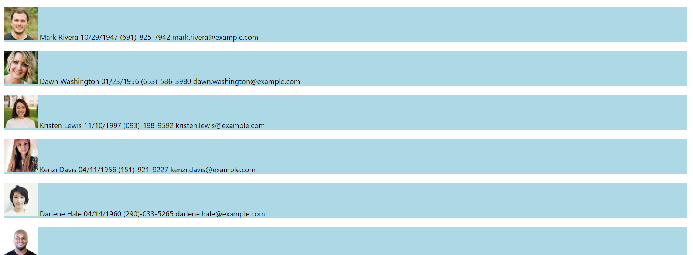

# EmployeeDirectory

## What is the app

* This is an application that will allow a user to search through an entire employee directory using any information that each individual has on file. The user simply has to enter information in the search bar and the employees shown will be narrowed down as the information is entered.

## The App Step-By-Step

* 

* This is a single page application.

* The top of the page contains a simple banner with the application title. The bottom of the page contains a list of all employees with their information.

* 

* In between these two components in the search bar.

* 

* As information is entered into the search bar the list of employees automatically updates to only show the employees who have information that matches what is being entered into the search bar.

